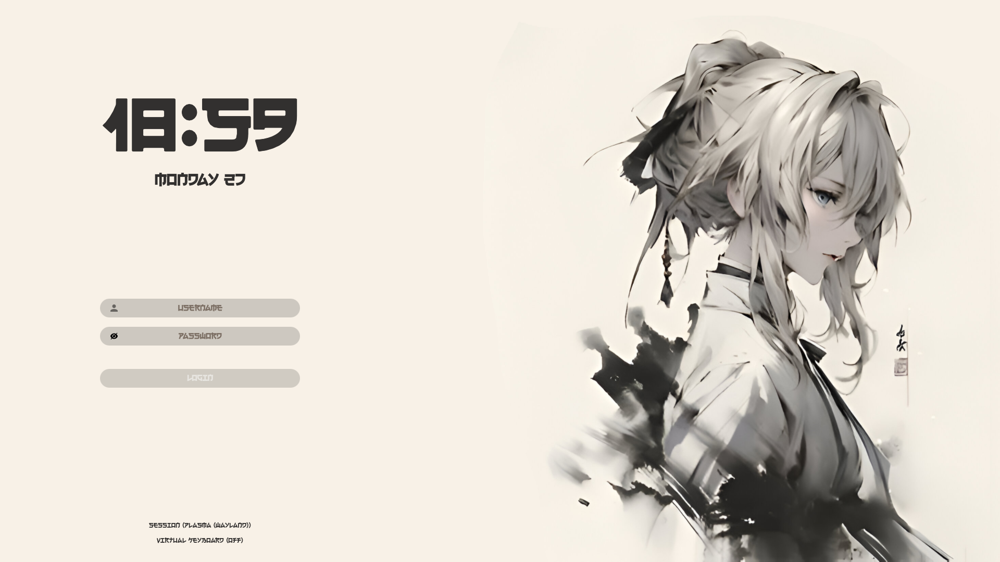
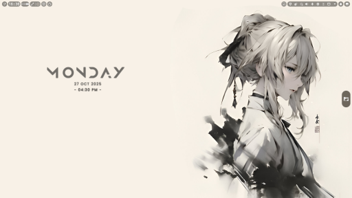
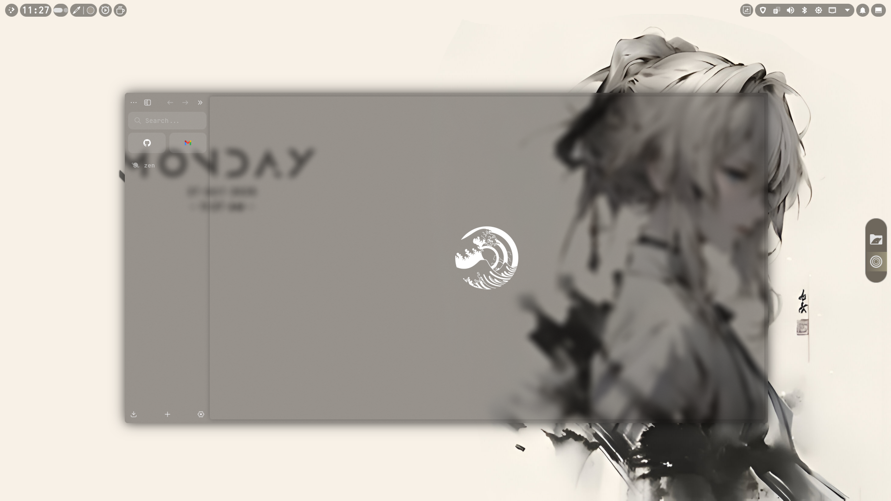
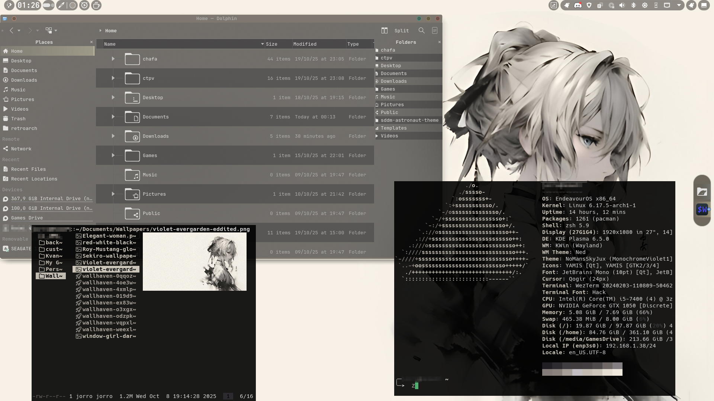

# Monochrome-Violet

A personalized theme I made.

The base themes that I used where the following:

 - Ned-dark (Global theme from KDE)
 - [This](https://github.com/lvrzrock/Dotfiles) one i used the configuration for the panels
 - [JuxTheme](https://github.com/juxtopposed/Mystical-Blue-Theme)

    - I used a this one as the basis for most of the theme

## Dependencies

When moving the files to their corresponding folders, you must first apply everything and then add the file `plasma-org.kde.plasma.desktop-appletsrc` again.
  
After adding the file you must go edit mode on the desktop and remove the old panels, they should be the bigger ones, I haven't found a way to do this automatically.. 

For the sddm screen, you must first install [this](https://github.com/Keyitdev/sddm-astronaut-theme) and then add the theme of this repo under `themes` after installation, Only if you want the font just like the image.
Follow the steps there to test out the theme.

 - [Better blur](https://github.com/taj-ny/kwin-effects-forceblur)
 - [Panel Colorizer](https://store.kde.org/p/2130967)

## TODO

- Add and config a launcher app (currently with kde deffault)
- easy install script for the whole theme 
- change wezterm font to a monospace
- add monochrome icon to:

    - zen, wezterm, obsidian
- Missing: window decorations, fonts for sddm(original installation), colors.colors 
